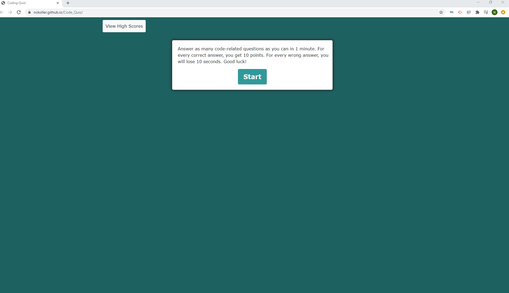
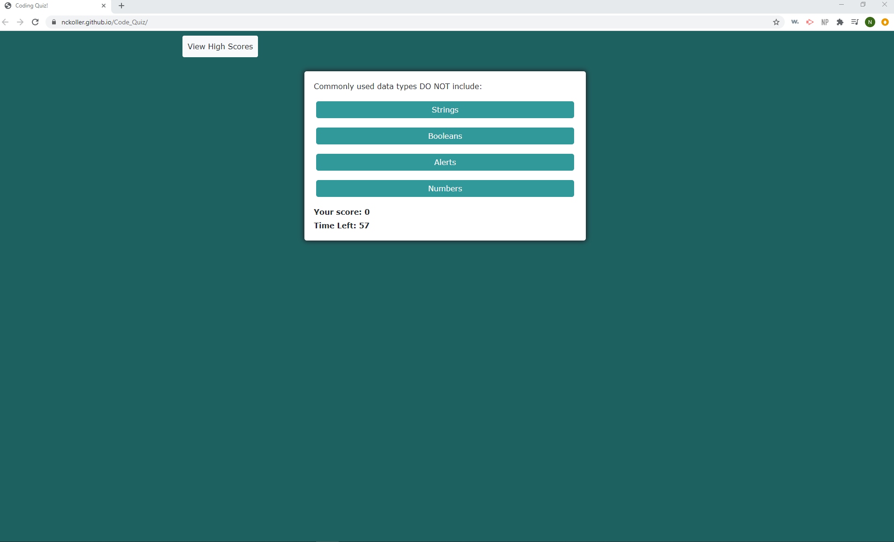
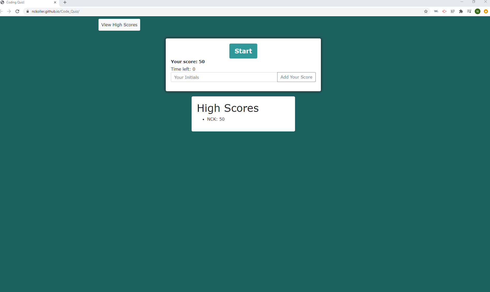

# Code_Quiz

This is a timed quiz with multiple choice questions based on the following acceptance criteria:

## Acceptance Criteria

```
GIVEN I am taking a code quiz
WHEN I click the start button
THEN a timer starts and I am presented with a question
WHEN I answer a question
THEN I am presented with another question
WHEN I answer a question incorrectly
THEN time is subtracted from the clock
WHEN all questions are answered or the timer reaches 0
THEN the game is over
WHEN the game is over
THEN I can save my initials and score
```

### URL for Quiz

<https://nckoller.github.io/Code_Quiz/>

## Demonstration of App





## Tech Stack

JavaScript
HTML
Bootstrap

## Credits

I created this code based on a homework prompt created by Trilogy Educaiton Services.
